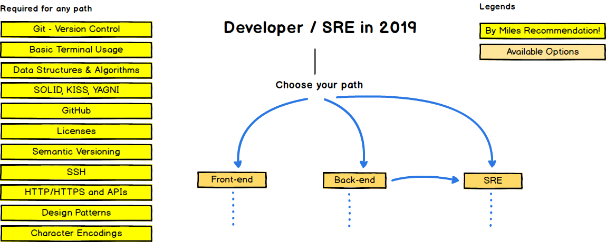
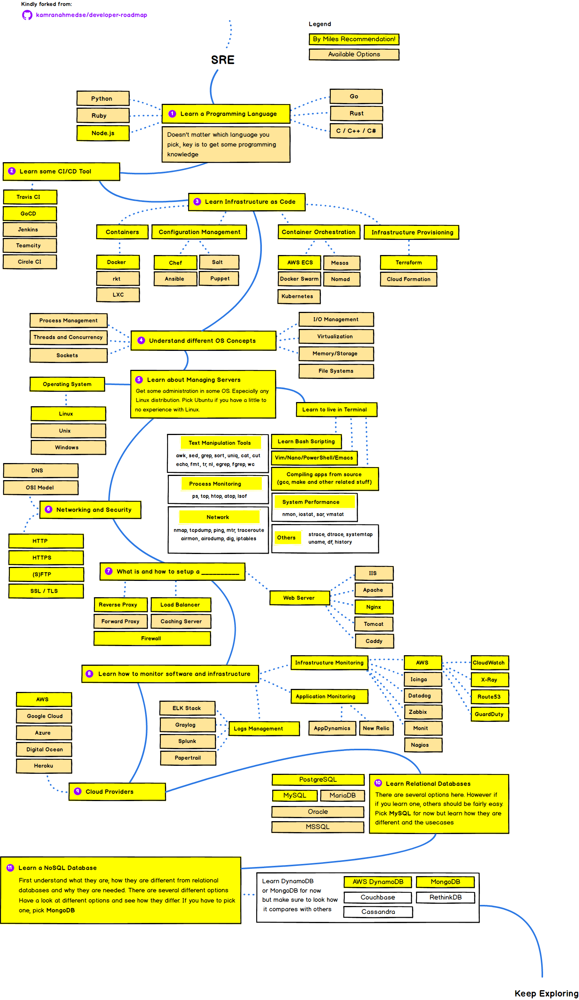

  
  <h2 align="center">Developer & SRE Roadmap</h2>
  
Roadmap to becoming a By Miles Developer or SRE in 2019

  

    
          
  

   

Below you find a set of charts demonstrating the paths that you can take and the technologies that you would want to adopt in order to become a frontend, backend developer or SRE at By Miles. Kindly forked from the original ideas and roadmaps @ https://github.com/kamranahmedse/developer-roadmap.

## Disclaimer
> The purpose of these roadmaps is to give you an idea about the By Miles landscape and to guide you if you are confused about what to learn next and not to encourage you to pick what is hip and trendy. You should grow some understanding of why one tool would be better suited for some cases than the other and remember hip and trendy never means best suited for the job.

## Introduction

<!-- ## Frontend Roadmap

## Back-end Roadmap

 -->

## SRE Roadmap

 
## License

